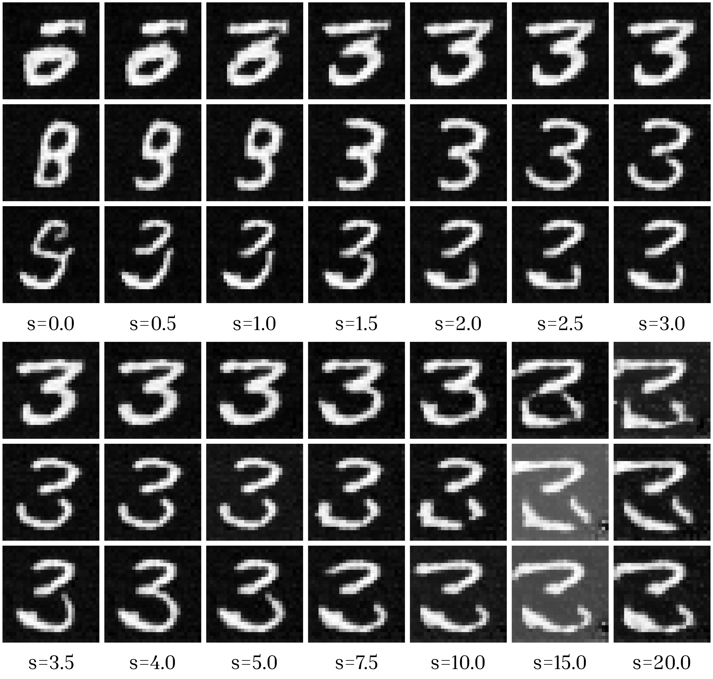

# Guidance Scale Effects in Classifier-Free Diffusion Models

This project seeks to understand the effects of guidance scale on classifier-free sampling of conditional diffusion models. We trained a conditioned UNET diffusion model on the MNIST dataset and sampled using classifier-free guidance. Classifier-free guidance is essential for modern image generation diffusion models, allowing label-dependent features become more prominant simply by changing a variable, the guidance scale. 

Choosing a correct guidance scale is critical during sampling. Low guidance scales result in cross-class artifacts and inadequate label representation, high guidance scales result in extreme pixel values and a lack of diversity; the optimal guidance scale lies between these extremes, balancing the tradeoff between diversity and label faithfulness.

This project empirically studies the effects of guidance scale on the generated samples. We trained a classifier to predict the label given the generated sample and used the accuracy of the classifier as a proxy for sample correctness.

## Details
- Dataset: MNIST (28x28, grayscale, normalized to [-1, 1])
- Model: U-net with time and label conditioning
- Training: 4000 steps, Adam, lr=1e-3, batch size 128
- Sampling: DDPM-style stochastic sampling, classifier-free guidance with label dropout (p=0.1)

## Results
Classifier accuracy peaks for guidance scales in the range s ∈ [1, 3] and degrades rapidly at higher values due to loss of diversity and overshooting.



## Reproducibility
To install dependencies:
```
pip install -r requirements.txt
```

To train the diffusion model:
```
python src/train.py path/to/model/output.pt
```

To run more training on an existing model:
```
python src/train.py path/to/model/output.pt -l path/to/previous/model.pt
```

To sample the digit 7 from a trained model:
```
python src/sample.py path/to/model.pt 7 path/to/sample/output/folder
```

To run experiment 1 from the writeup (digit control):
```
python experiments/1-digit-control.py path/to/model.pt path/to/sample/output/folder
```

To run experiment 2 from the writeup, with digit 3 (sample by guidance scale):
```
python experiments/2-guidance.py path/to/model.pt 3 path/to/sample/output/folder
```

To train a classifier (necessary for experiment 3):
```
python src/train-classifier.py path/to/classifier/model/output.pt
```
A classifier can continue training for more iterations using the `-l load/path.pt` modifier as used in the diffusion model training above.

To run experiment 3 from the writeup (classifier accuracy by guidance scale):
```
python experiments/3-classifier.py path/to/model.pt path/to/classifier.pt path/to/sample/output/folder
```

## Scope
This project is an empirical analysis of classifier-free guidance behavior in diffusion models. It does not propose a new algorithm and does not claim state-of-the-art performance.

## Writeup
See [writeup.pdf](writeup.pdf) for full experimental details and analysis.